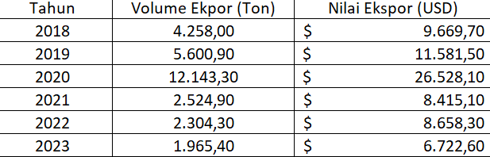
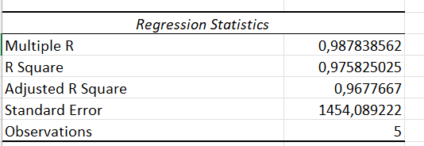
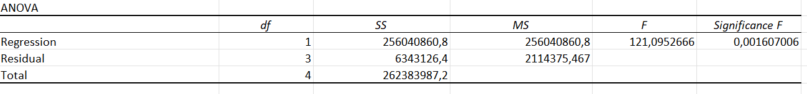
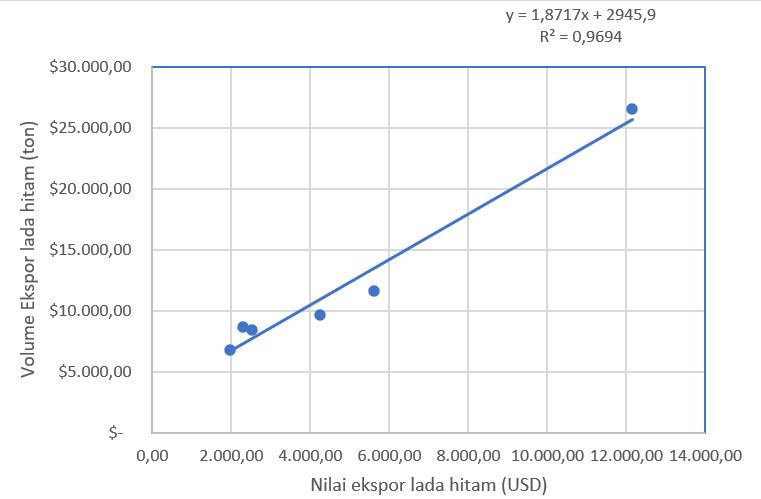

.jpg)

## Pendahuluan

### Latar belakang

Lada Hitam merupakan salah satu komoditas unggulan ekspor Indonesia yang memiliki peranan penting dalam perdagangan internasional. Provinsi Lampung dikenal sebagai penghasil lada hitam terbesar di Indonesia sejak zaman penjajahan. Ketersediaan lada hitam di Lampung didukung oleh luasnya lahan perkebunan, berkontribusi signifikan terhadap total produksi nasional. Vietnam, sebagai salah satu negara tujuan utama ekspor lada hitam, selain menjadi konsumen Vietnam merupakan pusat pengolahan dan re-ekspor lada hitam ke pasar global. Penelitian ini bertujuan untuk memahami lebih lanjut hubungan antara volume ekspor lada hitam Indonesia ke Vietnam dan nilai ekspornya untuk mendukung kebijakan perdagangan yang strategis.

### Ruang lingkup

Berdasarkan data ekspor lada hitam dari tahun 2018 hingga 2023 dari Badan Pusat Statistik dapat dilihat bahwa patner dagang utama dari komoditas lada hitam adalah Vietnam, Amerika Serikat, India, Perancis, dan lainnya. Vietnam merupakan negara utama pengimpor lada hitam terbesar. Maka, penelitian ini berfokus pada pengaruh volume ekspor lada hitam Indonesia terhadap nilai ekspor ke Vietnam selama periode 2018-2023.

### Rumusan masalah

1.  Apakah volume ekspor lada hitam Indonesia berpengaruh signifikan terhadap nilai ekspor ke Vietnam?
2.  Bagaimana Hubungan antara volume ekspor dan nilai ekspor selama periode penelitian?

### Tujuan dan manfaat penelitian

Penelitian ini bertujuan untuk mengidentifikasi pengaruh volume ekspor lada hitam terhadap nilai ekspor ke Vietnam, Memberikan informasi berbasis data untuk membantu pengambil keputusan bagi pelaku industry dan pemerintah dalam meningkatakan daya saing komoditas lada hitam di pasar Vietnam.

## Studi pustaka

Lada merupakan salah satu komoditas perkebunan Indonesia yang mampu menghasilkan devisa bagi negara dan merupakan komoditas ekspor tradisional Indonesia serta produk rempah-rempah tertua yang diperdagangankan di pasar dunia. (Sarpian, 2001)

Meningkatnya jumlah penduduk akan menyebabkan permintaan di dalam negeri dan luar negeri akan semakin meningkat. Di Indonesia, perkembangan jumlah dan pertumbuhan penduduk relatif tinggi, namun konsumsi lada masih relatif rendah, yakni hanya sekitar 26 persen dari produksi nasional. Dengan kata lain, sebagian besar produksi lada Indonesia diekspor ke pasar dunia. (Sajuti, 2002)

Lada Indonesia di pasar internasional banyak digunakan sebagai bahan baku yang penting dalam industri obat-obatan, farmasi, kosmetik, dan sebagai penyedap rasa bagi industri makanan dan restoran. Di Indonesia, lada putih maupun lada hitam banyak dihasilkan di beberapa daerah, dimana lada putih banyak dihasilkan di Provinsi Bangka Belitung, Kalimantan Tengah, dan Sulawesi, sedangkan lada hitam banyak dihasilkan di Provinsi Lampung dan Kalimantan Timur. (Marlinda, 2008).

Konsep Keunggulan komperatif David Ricardo menyoroti bahwa setiap negara memiliki spesialisasi tertentu yang menjadi nilai tambah dalam perdagangan internasional. Lampung sebagai penghasil lada hitam terbesar Indonesia memiliki potensi besar dalam mendukung keungguloan komperatif ini. Perdagangan lada hitam dengan Vietnam memperkuat posisi Indonesia dalam rantai pasok global.

Model gravitasi perdagangan menyatakkan bahwa volume perdagangan antara dua negara dipengaruhi oleh ukuran ekonomi (PDB) dan jarak geografis. Vietnam sebagai mitra dagang utama memiliki faktor kedekatan geografis yang signifikan, mendukung hubungan dagang yang efisien.

Penelitian ini sebelumnya menunjukkan bahwa Vietnam tidak hanya sebagai pasar konsumsi tetapi juga sebagai pusat re-ekspor lada hitam ke pasar global. Penelitian ini melanjutkan studi tersebut dengan menganalisis kontribusi spesifik Indonesia dalam perdagnagan ini, terutama dari sisi volume dan nilai ekspor.

## Metode penelitian

### Data

{fig-align="center"}

Penelitian ini menggunakan data sekunder yang mencakup volume ekspor lada hitam Indonesia ke Vietnam dalam satuan ton dan nilai ekspor dalam satuan USD. Data diambil dari Badan Pusat Statistik (BPS) untuk periode 2018 hingga 2023. Data ini disusun dalam tabel yang mencakup variabel bebas dan terikat, sesuai dengan kebutuhan analisis regresi.

### Metode analisis

Penelitian ini menggunakan metode analisis regresi linier sederhana untuk mengidentifikasi hubungan antara volume ekspor dan nilai ekspor lada hitam Indonesia ke Vietnam. Regresi linier sederhana dipilih karena metode ini dapat memberikan gambaran yang jelas mengenai pengaruh langsung variabel bebas terhadap variabel terikat.

Model regresi linier sederhana ini menjelaskan bahwa nilai ekspor lada hitam ke Vietnam (Y) dipengaruhi oleh volume ekspor (X). Intercept (β0) menunjukkan nilai awal ekspor ketika volume adalah nol. Koefisien (β1) menggambarkan perubahan nilai ekspor untuk setiap tambahan satu ton volume ekspor. Galat (ϵ) mencakup variasi data yang tidak dijelaskan oleh model. Evaluasi model dilakukan dengan menganalisis R Square, p-value, dan uji F untuk mengukur hubungan dan keakuratan model.

## Pembahasan

### Pembahasan masalah

Ekspor lada hitam Indonesia menunjukkan tren fluktuatif selama periode penelitian. Pada tahun 2020, volume ekspor mencapai puncaknya sebesar 12.143,30 ton dengan nilai tertinggi USD 26.528,10. Namun, setelah itu, terjadi penurunan signifikan baik pada volume maupun nilai ekspor hingga tahun 2023, dengan volume sebesar 1.965,40 ton dan nilai USD 6.722,60. Kondisi ini menunjukkan adanya tantangan yang perlu diatasi untuk menjaga stabilitas ekspor lada hitam.

### Analisis masalah

Hasil analisis regresi linier sederhana menunjukkan hubungan yang signifikan antara volume ekspor dan nilai ekspor, dengan koefisien korelasi (R) sebesar 0,9878. Persamaan regresi yang diperoleh adalah: Nilai R² sebesar 0,9694 menunjukkan bahwa hampir 97% variasi nilai ekspor dapat dijelaskan oleh perubahan volume ekspor. Selain itu, hasil uji F dan p-value yang signifikan mengindikasikan bahwa model regresi ini dapat dipercaya. Penurunan volume ekspor setelah tahun 2020 kemungkinan besar disebabkan oleh faktor eksternal, seperti penurunan permintaan global atau tantangan logistik.

Koefisien regresi memberikan gambaran rinci bahwa setiap peningkatan satu ton volume ekspor akan meningkatkan nilai ekspor sebesar 4258 USD. Intercept sebesar 3248,87 USD mengindikasikan nilai ekspor saat volume ekspor bernilai nol. Selain itu, p-value untuk koefisien (0,0016) lebih kecil dari 0,05, menunjukkan hubungan yang signifikan antara variabel. Secara keseluruhan, analisis ini menunjukkan bahwa volume ekspor adalah prediktor kuat untuk nilai ekspor lada hitam, menjadikan model ini relevan dalam menjelaskan dinamika perdagangan lada hitam ke Vietnam.

## Kesimpulan

Penelitian ini mengungkap hubungan yang signifikan antara volume ekspor lada hitam Indonesia ke Vietnam dengan nilai ekspornya selama 2018-2023. Analisis regresi linier sederhana menunjukkan bahwa peningkatan satu ton volume ekspor berkontribusi terhadap kenaikan nilai ekspor sebesar 1.860,8 USD. Koefisien determinasi (R²) sebesar 97,58% menunjukkan bahwa variasi nilai ekspor sebagian besar dapat dijelaskan oleh volume ekspor, dan p-value 0,0016 menguatkan signifikansi model.

Temuan ini menekankan pentingnya memaksimalkan volume ekspor sebagai strategi utama untuk meningkatkan nilai perdagangan lada hitam Indonesia di pasar Vietnam. Penelitian ini memberikan dasar bagi pelaku industri dan pembuat kebijakan untuk mengembangkan langkah-langkah strategis guna meningkatkan daya saing lada hitam Indonesia di pasar internasional. Kajian tambahan terkait faktor eksternal, seperti harga global dan tarif perdagangan, dapat memberikan wawasan yang lebih mendalam untuk mendukung upaya ini.

## Referensi

Agung Hardiansyah, D. B. (2015). ANALISIS KEUNGGULAN KOMPARATIF LADA INDONESIA.

Ernah, S. Y. (2024). Kajian Daya Saing Lada Hitam Indonesia di Pasar Internasional. Retrieved from https://journal.uniga.ac.id/index.php/MJA/article/view/3968

Reinaldi, R. Y. (2023). ANALISIS EKSPOR LADA HITAM INDONESIA KE NEGARA TUJUAN UTAMA.
